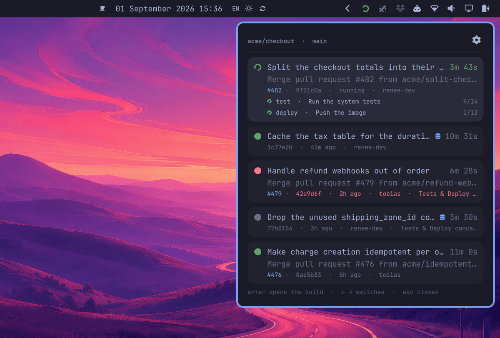
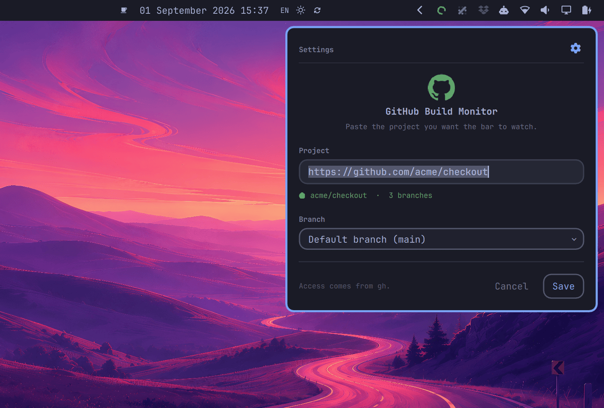

# GitHub Build Monitor

Whether the branch you deploy from is green right now, in the Omarchy bar.

The mark spins while a build is running, goes green for a minute when one passes, and turns red and stays red when one fails. That asymmetry is the point: a build that went green is news for about as long as it takes to notice it, and after that it is just the normal state of things, so it steps back and leaves a small coloured dot on the corner of the icon. A build that broke is not news, it is a job, and it keeps saying so until a later build replaces it.

Open the panel and you get the last builds, each with what it was, how long it took, who pushed it (with their face on it) and whether it touched a migration. Enter opens one on GitHub, and the pull request number next to it opens that.



## What counts as a build

A commit, not a workflow run. One push to main starts several workflows and they finish minutes apart, so following any single one of them means saying green while the deploy is still going. Every push-triggered run is grouped by its commit and rolled up: running if anything is still going, red if anything failed, and the duration is the wall clock from the first run starting to the last one ending, which is the wait an actual person sits through.

Scheduled jobs and workflows triggered by a comment are left out. They attach to the head of the branch too, and counting them would turn a green main red because a nightly cron failed.

While a build is running, its row lists the jobs that are working and the step each one is on, so "still going" has something behind it.

## Requirements

The [`gh` CLI](https://cli.github.com), logged in. Every request goes through it, which means no token is ever stored by this plugin or handed to a process as an argument, and private repositories work exactly as far as your `gh` login can see them.

## Installing it

```bash
omarchy plugin add https://github.com/jankeesvw/omarchy-github-build-monitor
omarchy bar move jankeesvw.github-build-monitor --section right
```

Open the panel and it asks for the project the first time. Paste the GitHub URL, the same one you have in your browser, and it checks while you type whether `gh` can actually see it. The mark swings between red and green while it looks and settles on the answer. If `gh` cannot see the project it says so on the spot, rather than leaving you with a grey icon and no reason for it. Pick a branch or leave it on the default, which follows whatever the project calls it, main or master.



You can reopen that screen from the gear, or with `s`. The card turns over to get there, because a bar widget is a small object you look at rather than a page you navigate, and turning it over to find its controls on the back is how a small object works.

<video src="https://github.com/jankeesvw/omarchy-github-build-monitor/raw/main/screenshots/flip.mp4" controls width="520"></video>

The settings live in this widget's own entry in `~/.config/omarchy/shell.json`, which is the same place the bar's own settings screen reads from, so the two never disagree.

## Reading the bar

| | |
|---|---|
| Spinning ring | a build is running |
| Green mark | a build passed in the last minute |
| Red mark | the last build failed, and it stays red |
| Green, red or grey dot | what the last build did, once the fuss is over |

Grey is a cancelled build, which is what GitHub does to a run when a newer push supersedes it.

## Migrations

A build whose commit touched a file with `migrate` or `migration` in its path gets a database mark in the list. Hover it and it names the files. A schema change is worth knowing about before you deploy over it or roll it back, and that is not something a status colour can tell you.

The paths it looks for are a setting, comma separated. Emptying it turns the marks off, and saves one API request per new commit.

## Keyboard

Everything works without the mouse. Arrows or `j`/`k` walk the list and Tab wraps around it, left and right switch between the build and the pull request it came in through, Enter opens whichever you are on, `s` opens the settings, `r` refreshes, Escape closes. In the settings screen Tab walks the fields and Escape turns the card back over.

## What it costs

One request a minute while nothing is happening, one every ten seconds while a build is running, and one more per commit nobody has looked at before. On a 5000 request hourly budget that is around two percent.

## Removing it

```bash
omarchy plugin remove jankeesvw.github-build-monitor
```

That leaves one thing behind: `~/.cache/omarchy-github-build-monitor/`. It holds one file per project you watched, each with the commit shas of the last handful of builds and the matching file paths inside them, plus an `avatars/` folder with one small picture per person who pushed to a branch you watched. Both are there so the plugin does not ask GitHub the same unchanging question every minute. Nothing else is stored, no token is ever written, and the directory and everything in it is yours alone at 700 and 600. Delete it with:

```bash
rm -rf ~/.cache/omarchy-github-build-monitor
```

Your settings live in `~/.config/omarchy/shell.json` and go with the widget when you remove it.

## Licence

MIT.
